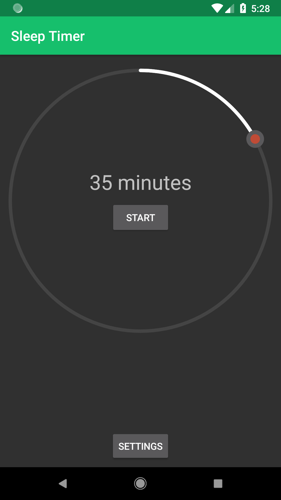
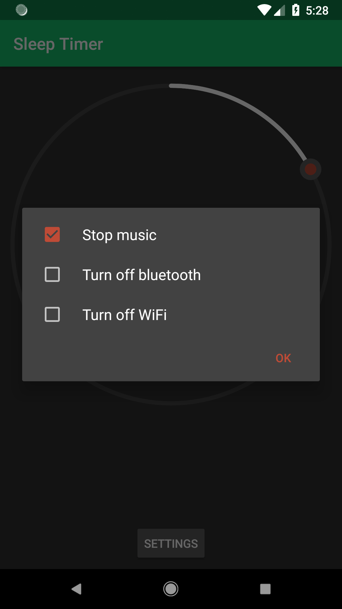

# Sleep Timer

Simply start your music, run the Sleep Timer app, and set the countdown timer.

At the end of the countdown, Sleep Timer will stop your music or any media that is currently playing.

You can also stop WiFi and Bluetooth!

	
	

